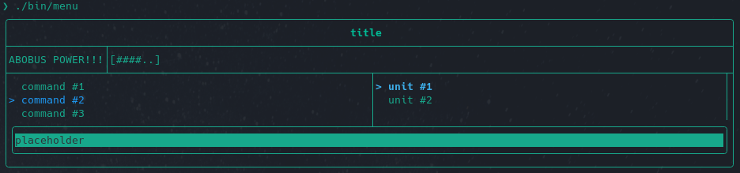

# tui-menu

Консольный пользовательский интерфейс для управления контейнерами данных



## Сборка

Убедитесь, что у вас установлен менеджер пакетов [conan](https://conan.io)
и произведены его необходимые базовые настройки:

```sh
conan profile new default --detect
conan profile update settings.compiler.libcxx=libstdc++11 default # linux
conan profile update settings.compiler.libcxx=libc++11 default    # macos
```

Дополнительные флаги сборки:

 * -DDEBUG=1 - для [gdb](https://www.sourceware.org/gdb/)

 * -DCMAKE_EXPORT_COMPILE_COMMANDS=1 - помогает редактору кода увидеть
 библиотеки и файлы

```sh
mkdir build
cd build
conan install ..
cmake ..
make
```

## Запуск

Находясь в tui-menu/build:  
`./bin/menu`

## API

Краткое описание возможностей библиотеки

### Концепты

```cpp
template<typename T>
concept StringLike = std::is_convertible_v<T, std::string_view>;
```

`StringLike` ограничивает шаблонный параметр `T` типами,
конвертируемыми в строковый вид

### Класс MainScreen

Основной класс, отвечающий за работу программы

#### Публичные поля

```cpp
std::string Title;
std::string InfoBar;
std::string UnitName;
std::string InputField;
```

#### Методы

```cpp
MainScreen(const std::string& title, Menu* commands, Menu* units)
```

Конструктор принимает строку для заголовка и два указателя
на соответствующие объекты меню.

---

```cpp
void
render()
```

Метод, запускающий обработку интерфейса

---

### Класс Menu

Класс, позволяющий управлять содержимым меню

#### Типы

```cpp
using OnEnterHandler = std::function<void(MainScreen*)>;
using MenuItemList   = std::vector<std::string>;
using HandlerList    = std::vector<OnEnterHandler>;
using ItemsAddList   = std::vector<std::pair<
    std::string,
    OnEnterHandler
>>;
```

#### Методы

```
template<StringLike Name>
void
addItem(Name&& item, OnEnterHandler handler)
```

Добавление в меню нового элемента и его обработчика

---

```
void
addItems(ItemsAddList&& items)
```

Добавление в меню сразу нескольких элементов и их обработчиков

---

