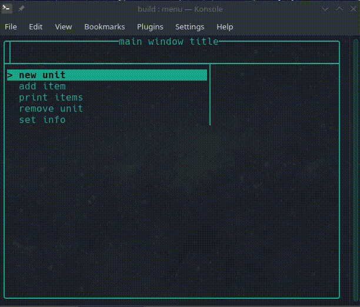

# tui-menu v0.3.0

Консольный пользовательский интерфейс (TUI) для управления контейнерами данных

Для навигации используются стрелки, выход по нажатию `Escape`

## Демо



## Пример кода

```cpp
#include <string>
#include <utility>
#include <vector>

#include "tui-menu/inputwindow.hpp"
#include "tui-menu/mainwindow.hpp"
#include "tui-menu/tui.hpp"
#include "tui-menu/validators.hpp"


int
main()
{
    tuim::TerminalUserInterface tui;
    tuim::MainWindow<std::vector<int>> mw("main window title");
    tuim::InputWindow iw_str("input window title", "len [1; 8]");
    tuim::InputWindow iw_num("number input", "type number [-99; 99]");

    lid_t mwd     = tui.add_layer(&mw, true);
    lid_t iwd_str = tui.add_layer(&iw_str);
    lid_t iwd_num = tui.add_layer(&iw_num);

    mw.add_commands({
        {"new unit", [&] {
            iw_str.on_ok = [&] {
                mw.add_unit(iw_str.content());
                tui.set_layer(mwd);
            };
            iw_str.reset();
            tui.set_layer(iwd_str);
        }},
        {"add item", [&] {
            if (mw.units_empty())
                return mw.set_info("create/select a unit before");

            iw_num.reset();
            tui.set_layer(iwd_num);
        }},
        {"print items", [&] {
            std::string buffer;
            for (const auto& item : mw.current_unit())
                buffer += std::to_string(item) + ", ";

            mw.set_info(std::move(buffer));
        }},
        {"remove unit", [&] {
            iw_str.on_ok = [&] {
                mw.remove_unit(iw_str.content());
                tui.set_layer(mwd);
            };
            iw_str.clear_content();
            tui.set_layer(iwd_str);
        }},
        {"set info", [&] { mw.set_info("some useful info"); }},
    });

    iw_str.on_cancel = [&] { tui.set_layer(mwd); };
    iw_str.validator = tuim::length_range(1, 8);

    iw_num.on_ok     = [&] {
        mw.current_unit().push_back(std::stoi(iw_num.content()));
        tui.set_layer(mwd);
    };
    iw_num.on_cancel = [&] { tui.set_layer(mwd); };
    iw_num.validator = tuim::is_numeric() | tuim::in_range(-100, 100);

    tui.render();

    return 0;
}

```

## Сборка

`.h`/`.hpp` файл своего контейнера можно положить в каталог `include/`

Убедитесь, что у вас установлен менеджер пакетов [conan](https://conan.io)
и произведены его необходимые базовые настройки:

```sh
conan profile new default --detect
conan profile update settings.compiler.libcxx=libstdc++11 default # linux
conan profile update settings.compiler.libcxx=libc++11 default    # macos
```

Дополнительные флаги сборки:

 * -DDEBUG=1 - для [gdb](https://www.sourceware.org/gdb/)

 * -DCMAKE_EXPORT_COMPILE_COMMANDS=1 - помогает редактору кода увидеть
 библиотеки и файлы

```sh
mkdir build
cd build
conan install ..
cmake ..
cmake --build .
```

## Запуск

Находясь в build:  
`./bin/menu`

