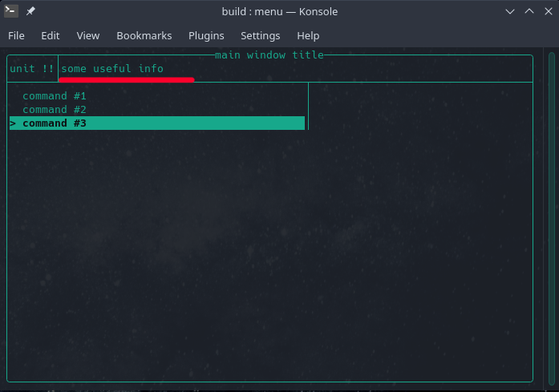

# API

Краткое описание возможностей библиотеки

## Типы и Концепты

```cpp
template<typename T>
concept string_like = std::is_convertible_v<T, std::string_view>;
```

Концепт `string_like` ограничивает шаблонный параметр `T` типами,
конвертируемыми в строковый вид

---

```cpp
using Validator = std::function<bool(std::string_view)>;
```

Тип для описания функции обработки корректности ввода в `InputWindow`

---

## Валидаторы

```cpp
tuim::Validator
operator|(const tuim::Validator& lhs, const tuim::Validator& rhs)
```

Данная перегрузка оператора `|` позволяет объединять множество функций типа `tuim::Validator`

__Пример__:  
Ограничение ввода лишь числами в диапазоне `[-100; 100]`

```cpp
using namespace tuim;
Validator validator = is_numeric() | in_range(-100, 100);
```

---

```cpp
Validator
is_numeric()
```

Определяет, является ли строка числом

---

```cpp
Validator
length_range(size_t minimum, size_t maximum)
```

Ограничивает длину ввода диапазоном `[minimum; maximum]`

---

```cpp
Validator
in_range(float minimum, float maximum)
```

Ограничивает число диапазоном `[minimum; maximum]`

---

## Класс `TerminalUserInterface`

Основной класс, отвечающий за работу программы

### Типы

`lid_t` - тип дескриптора окна

### Методы

```cpp
lid_t
add_layer(WindowBase* layer, bool as_main = false)
```

`layer` - указатель на класс окна, которое нужно добавить  
`as_main` - флаг, определяющий роль окна (главное/дополнительное),
перезаписывает старый дескриптор главного окна

Возвращает дескриптор добавленного окна (слоя)

---

```cpp
void
set_layer(lid_t lid)
```

`lid_t` - дескриптор окна

Устанавливает окно (слой) для рендера

---

```cpp
set_main_layer(lid_t lid)
```

`lid_t` - дескриптор окна

Устанавливает основной слой рендера

---

```cpp
void
render()
```

Метод, запускающий обработку интерфейса

---

```cpp
void
exit()
```

Завершает работу программы

---

## Класс `MainWindow<T>`

Класс, позволяющий управлять меню команд и контейнерами

### Типы

```cpp
using container_type = T;
```

Тип вашего контейнера

---

```cpp
using ItemsList = std::vector<std::pair<std::string, std::function<void()>>>;
```

Тип для описания списка элементов вида `<название, обработчик>`

---

### Методы

```cpp
MainWindow(string_like auto&& title)
```

Конструктор, устанавливающий заголовок окна

---

```cpp
void
set_info(string_like auto&& text)

const std::string&
get_info() const
```

Возвращает/устанавливает содержимое поля для вывода информации



---

```cpp
const std::string&
selected_command() const
```

Возвращает название выбранной на данный момент команды

---

```cpp
const std::string&
selected_unit_name() const
```

Возвращает имя выбранного на данный момент контейнера

---

```cpp
void
add_commands(ItemsList&& commands)
```

Добавляет команды и их обработчики из `commands` в общий список

---

```cpp
template <typename... Args>
bool
add_unit(string_like auto&& unit, Args... args)
```

Добавляет новый контейнер с именем `unit`, список параметров `args` передаётся
в конструктор вашего контейнера

Возвращает результат `true`, если контейнер был добавлен успешно и `false`,
если контейнер с таким именем уже существует

---

```cpp
bool
remove_unit(const std::string& unit)
```

Удаляет контейнер по его названию `unit`

Возвращает `true`, если контейнер был удалён успешно и 'false',
если контейнера с таким именем нет

---

```cpp
container_type&
current_unit()
```

Возвращает ссылку на текущий активный контейнер (определяется полем имени юнита)

Если контейнер не выбран явно (поле имени юнита пустое),
то поля юнита будет установлено первым значением из списка контейнеров

Если список контейнеров пуст,
будет выброшено исключение `std::runtime_exception`


---

```cpp
bool
units_empty() const
```

Проверка на пустоту списка контейнеров

---

```cpp
size_t
units_count() const
```

Возвращает количество контейнеров в списке

---

## Класс `InputWindow`

Класс окна для чтения пользовательского ввода

### Методы

```cpp
InputWindow(
	string_like auto&& title,
	string_like auto&& placeholder = ""
)
```

Конструктор, устанавливающий заголовок окна и плейсхолдер поля ввода

---

```cpp
bool
correct() const
```

Определяет корректность содержимого поля ввода

---

```cpp
const std::string&
content() const
```

Возвращает содержимое поля ввода

---

```cpp
const std::string&
get_placehodler() const

void
set_placeholder(string_like auto&& text)
```

Возвращает/устанавливает содержимое плейхолдера поля ввода

---

```cpp
void
clear_placeholder()
```

Очищает плейсхолдер поля ввода

---

```cpp
void
clear_content()
```

Очищает содержимое поля ввода

---

```cpp
void
reset()
```

Очищает содержимое поля ввода и устанавливает на нём фокус

---

### Обработчики

```cpp
Validator validator
```

Обработчик, неявно принимающий в качестве единственного аргумента содержимое поля ввода и определяет его корректность.

---

```cpp
std::function<void()> on_ok
```

Отвечает за обработку нажатия кнопки ОК или Enter на поле ввода

---

```cpp
std::function<void()> on_cancel
```

Отвечает за обработку нажатия кнопки Отмена

---
